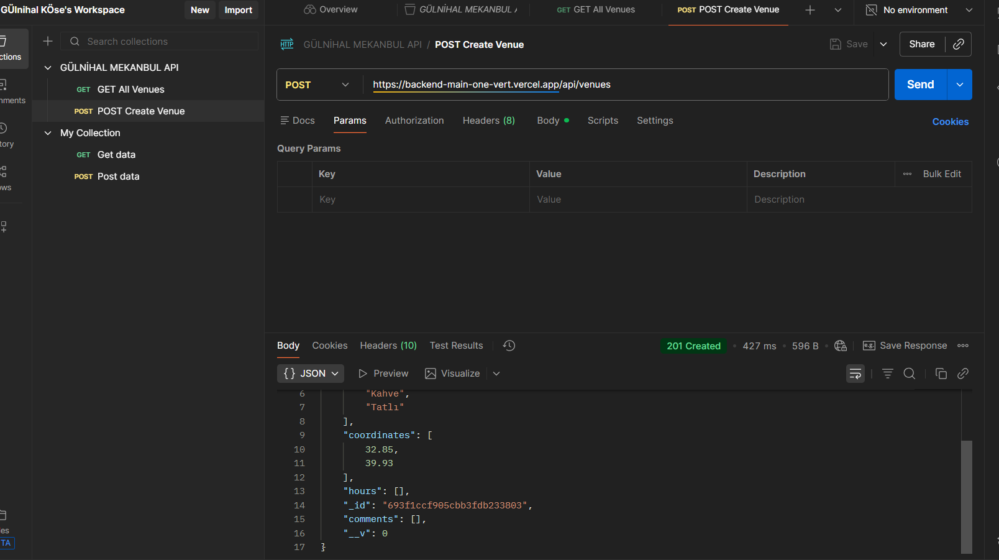
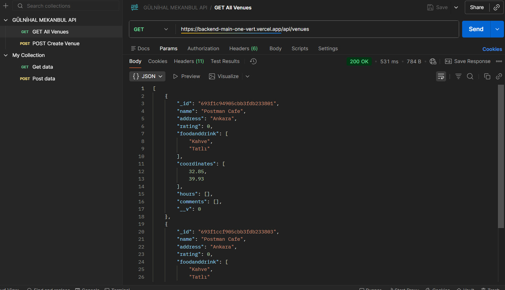
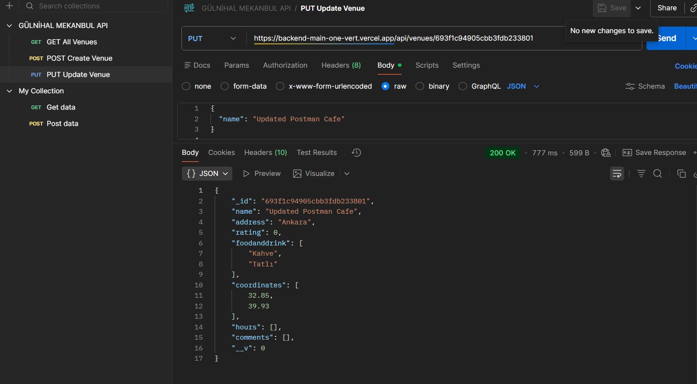
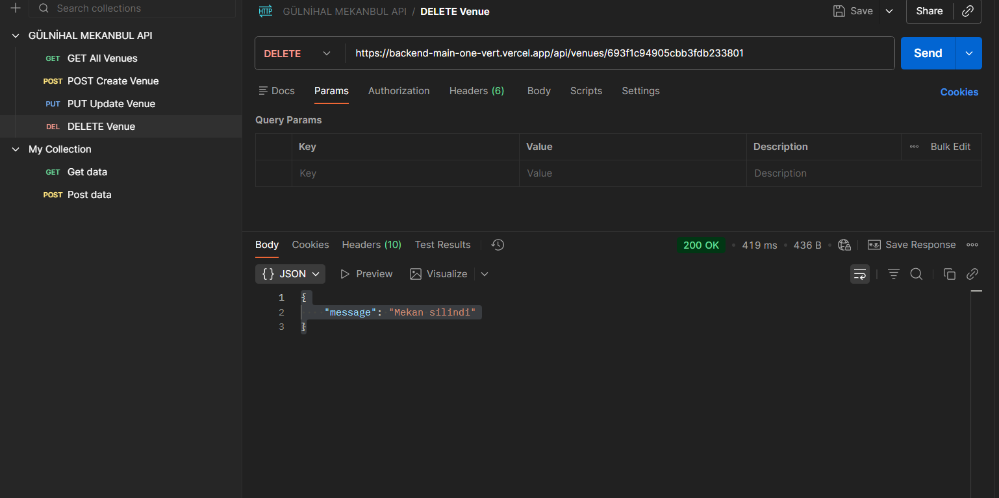

# Backend API Projesi

Bu proje Node.js, Express ve MongoDB Cloud (Atlas) kullanılarak geliştirilmiş bir backend API projesidir.  
Proje Vercel üzerinde yayınlanmıştır.

## Canlı Proje (Vercel)
https://backend-main-one-vert.vercel.app

## Veritabanı
- MongoDB Cloud (Atlas)
- Bağlantı bilgisi `.env` dosyası üzerinden `MONGODB_URI` değişkeni ile alınmaktadır.
- `MONGODB_URI` değişkeni Vercel Environment Variables bölümünde tanımlıdır.

## API Endpointleri

### Tüm Mekanları Getir
## API Testleri (Postman)

### GET – Tüm Mekanlar

### POST – Mekan Ekleme

### PUT – Mekan Güncelleme

### DELETE – Mekan Silme

